# 云端酒店管理系统（Cloud Hotel）

> 一套面向中高端酒店的全链路数字化管理解决方案：客人通过微信小程序选房/订房/呼叫服务/AI 客服；前台通过桌面端办理入住、退房、房态管理；管理员通过后台进行房型/订单/财务/员工/知识库/系统配置等全栈运营。

---

## 项目亮点

- **三端协同**：客户端（uni-app 小程序）+ 前台端（Vue 3 桌面端）+ 管理端（Vue 3 后台）
- **微服务架构**：Spring Boot 3 + Spring Cloud Gateway + Nacos，按业务领域拆分用户/房间/订单/财务服务
- **AI 赋能**：DeepSeek + LangChain 智能客服、房型推荐、自然语言订单查询、知识库 RAG
- **业务闭环**：浏览 → 推荐 → 预订 → 支付 → 入住 → 服务/商品 → 退房 → 财务统计
- **工程化**：JWT 鉴权、Sentinel 限流、RabbitMQ 异步解耦、Kafka + ELK 日志链路

---

## 架构概览

```
┌─────────────────────────────────────────────────────────────────┐
│                          展示层                                   │
│  ┌──────────────┐  ┌──────────────┐  ┌──────────────────────┐  │
│  │  管理端      │  │  前台端      │  │  客户端（uni-app）    │  │
│  │  Vue 3 + TS  │  │  Vue 3 + TS  │  │  微信小程序 / H5 / APP│  │
│  │  :5173       │  │  :5174       │  │                       │  │
│  └──────┬───────┘  └──────┬───────┘  └──────────┬────────────┘  │
└─────────┼─────────────────┼─────────────────────┼───────────────┘
          │                 │                     │
          └─────────────────┴──────────┬──────────┘
                                       │
                         ┌─────────────▼─────────────┐
                         │  Spring Cloud Gateway     │
                         │           :8088           │
                         └─────────────┬─────────────┘
                                       │
          ┌────────────┬───────────────┼───────────────┬────────────┐
          │            │               │               │            │
┌─────────▼────┐ ┌────▼──────┐ ┌──────▼─────┐ ┌───────▼────┐ ┌────▼──────┐
│ user-service │ │room-service│ │order-service│ │finance-    │ │ ai-service│
│    :8081     │ │   :8082    │ │    :8083    │ │  service    │ │  :8000    │
│ 用户/客户/登录 │ │ 房型/房间  │ │ 订单/支付/服务│ │  :8084     │ │ FastAPI   │
└──────────────┘ └───────────┘ └─────────────┘ └────────────┘ └───────────┘
```

---

## 一、客户端（uni-app 微信小程序）

为住客提供从浏览、预订、入住到离店的全流程自助服务。

### 1.1 首页

轮播 Banner、热门房型、快捷入口（浏览房型 / 智能客服 / 智能推荐 / 我的订单）以及服务功能（呼叫人员）。

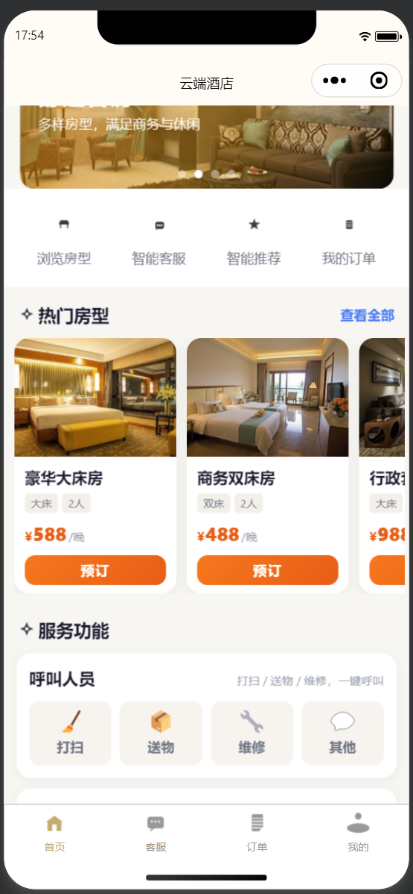

### 1.2 房型详情

房型大图、面积/床型/人数/可订房间、设施标签、日期与数量选择，一键立即预订。

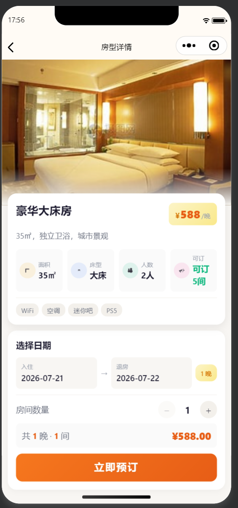

### 1.3 智能客服

基于 DeepSeek + LangChain 的多轮对话，支持酒店政策咨询、订单查询、房型推荐。

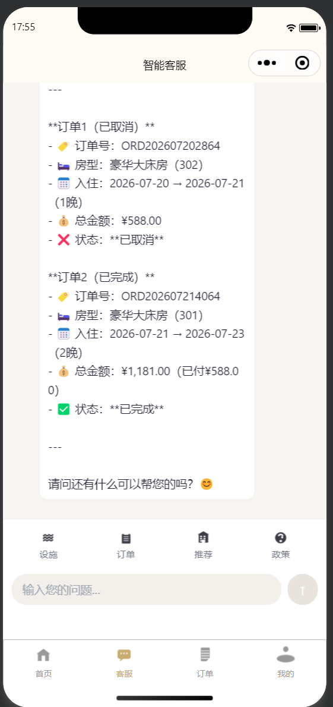

### 1.4 我的订单

按状态（全部 / 待支付 / 已确认 / 入住中 / 已完成）筛选，展示订单号、房型、日期、金额。

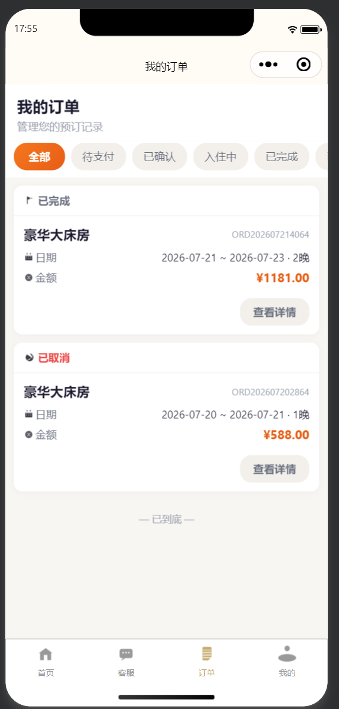

### 1.5 个人中心

会员等级、积分余额、编辑资料、修改密码、退出登录。

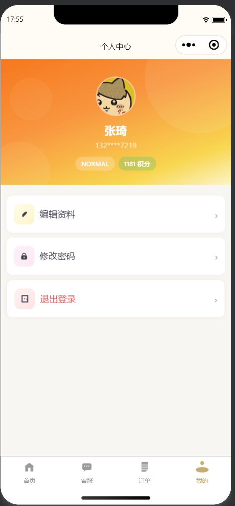

---

## 二、前台端（Vue 3 + Element Plus）

酒店前台接待人员的日常操作桌面，聚焦效率与可视化。

### 2.1 首页 / 工作台

今日入住/退房/预订、实时营收、房态概览、系统通知、快捷操作。

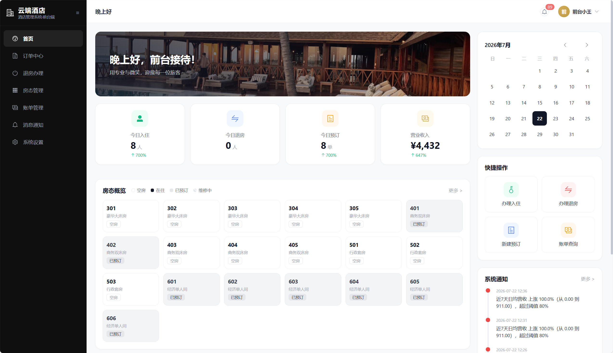

### 2.2 房态管理

按楼层分组展示所有房间，空闲/预订/入住/清洁/维修状态一目了然，支持办理入住。

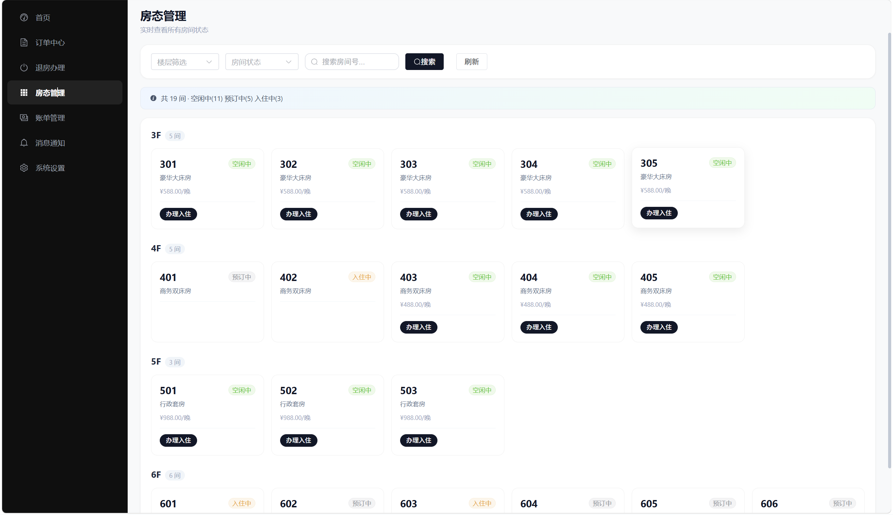

### 2.3 订单中心

订单列表、状态筛选、客户信息、操作入口（详情 / 入住 / 换房 / 支付 / 取消）。

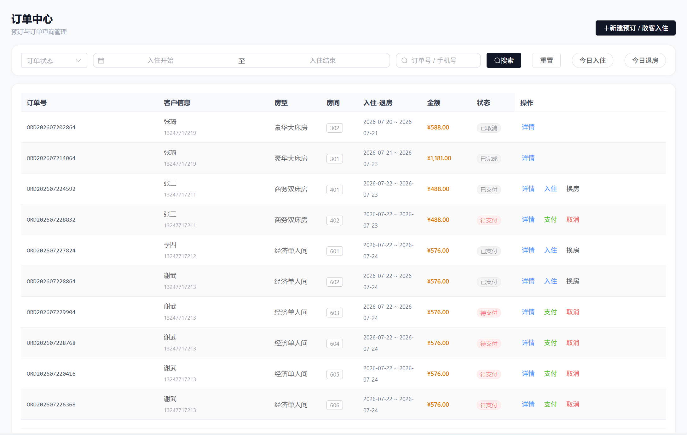

### 2.4 订单详情

订单信息、客户信息、房间信息、费用明细与快捷操作（确认收款 / 取消订单）。

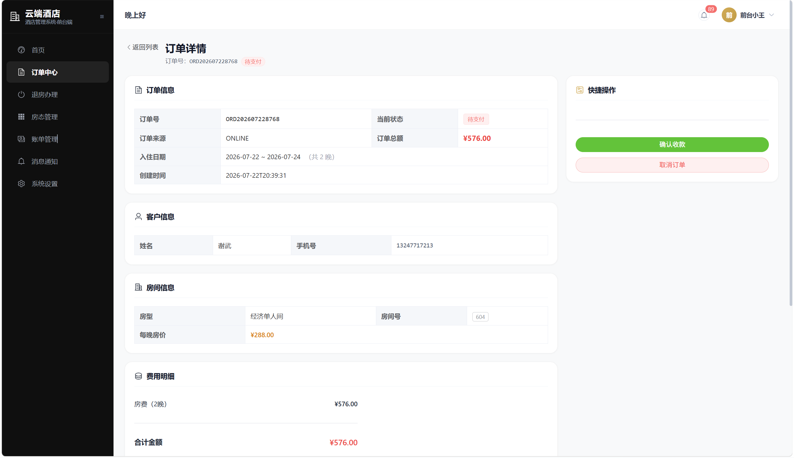

### 2.5 退房办理

展示在住订单列表，支持退房与消费结算（商品/服务费用一并结清）。

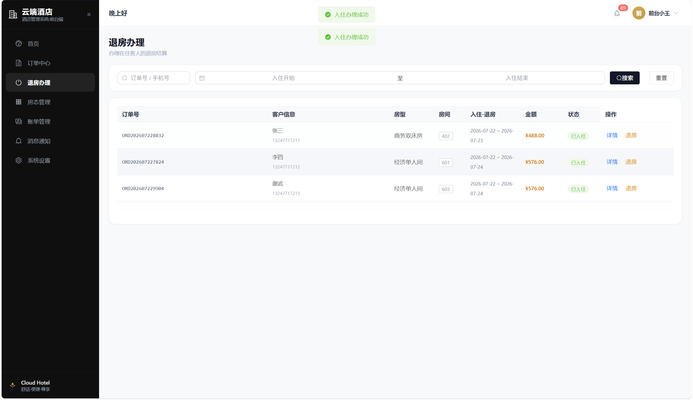

### 2.6 消息通知

实时接收客户的服务呼叫与商品订单，支持"安排人员"处理和"安排配送"。

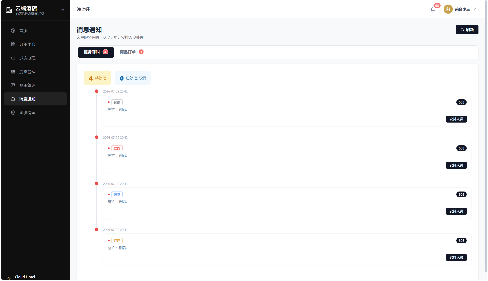

---

## 三、管理端（Vue 3 + TypeScript + Vite）

酒店运营与系统管理后台，覆盖数据看板、业务配置与知识库运营。

### 3.1 工作台

营收/入住率/在售房型/未处理告警等核心指标，近 7 日营收趋势与房型入住率 Top 5。

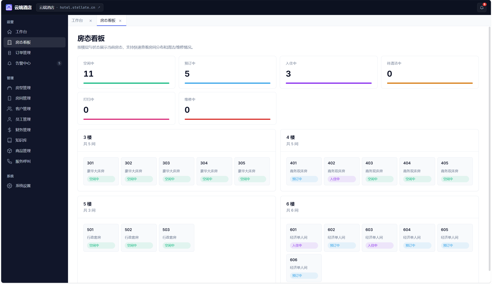

### 3.2 房型管理

房型 CRUD、封面图与轮播图上传、设施标签、价格/面积/床型/最大入住人数维护。

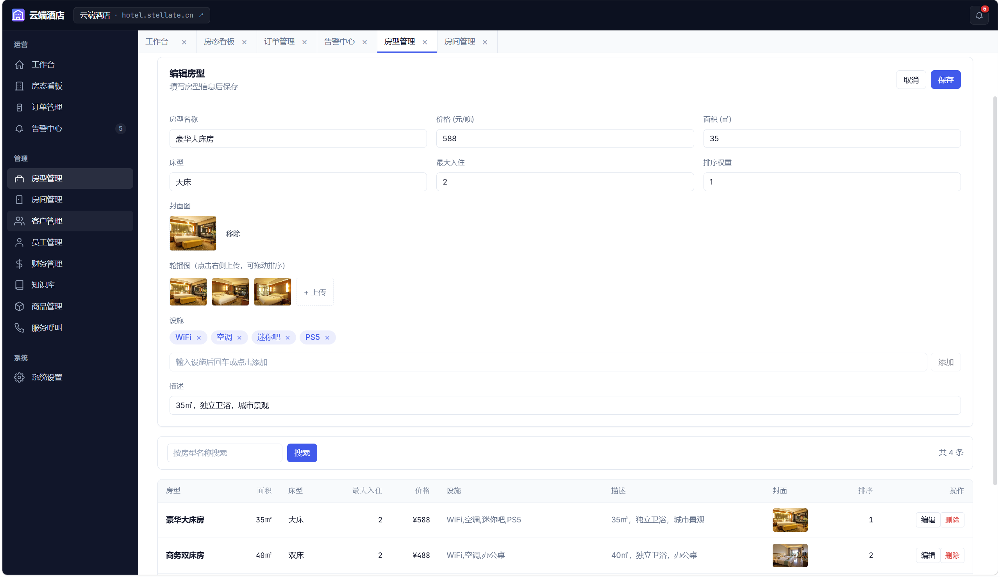

### 3.3 订单管理

全量订单查询、来源/状态筛选、客户/手机号/房号检索、导出与新增订单。

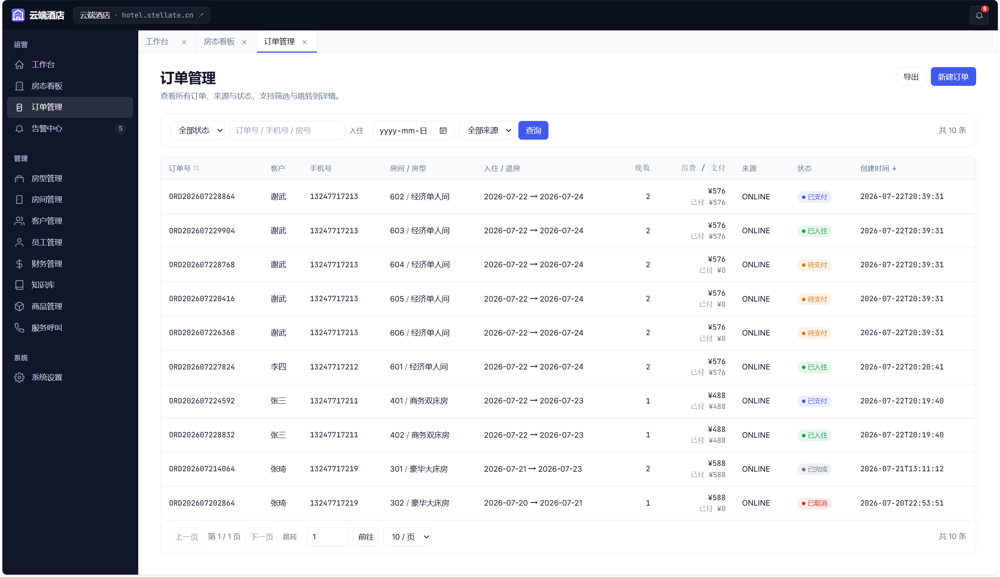

### 3.4 财务管理

今日/本月/本年营收、近 7 日营收趋势、房型营收排名、房型入住率对比。

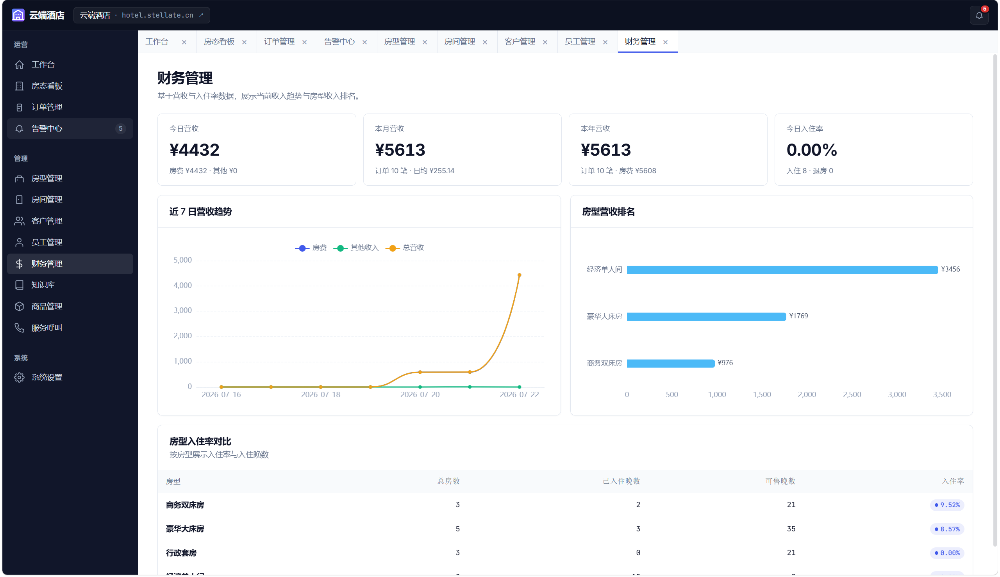

### 3.5 告警中心

系统异常与价格异常告警，支持批量标记已读与删除。

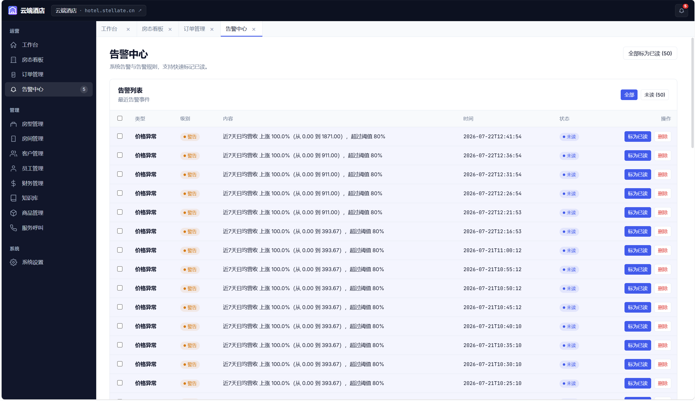

### 3.6 商品管理

客房商品（食物/日用品等）维护、库存管理、补货操作，供客户端下单。

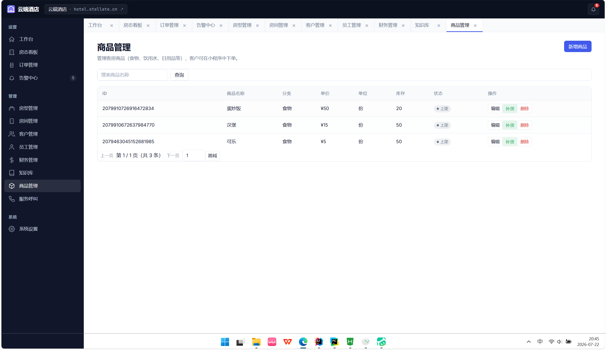

### 3.7 知识库管理

上传 PDF / TXT / DOCX / MD 文档，自动向量化并供 AI 客服检索回答。

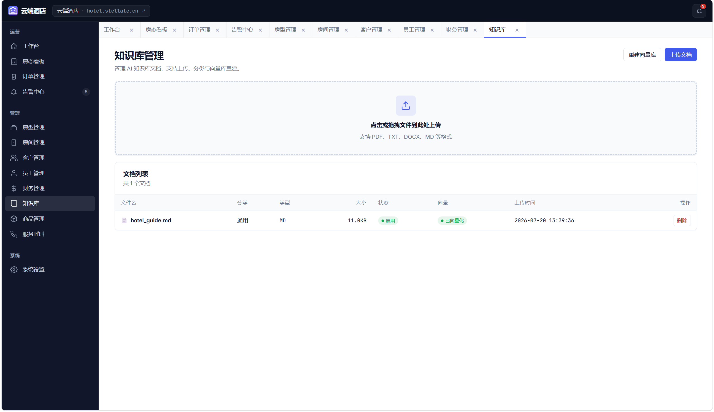

### 3.8 酒店设置

酒店名称、联系电话、地址、入住/退房时间、满房预警阈值、积分抵扣开关与比例等全局参数。

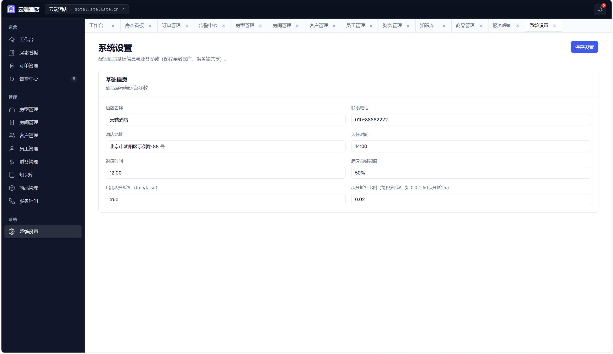

---

## 四、技术栈

| 层级 | 技术 |
|------|------|
| 后端框架 | Spring Boot 3.3.6 + Spring Cloud 2023.0.4 |
| 微服务组件 | Nacos（注册中心/配置中心）、Spring Cloud Gateway、Sentinel |
| ORM | MyBatis-Plus 3.5.9 + Druid 连接池 |
| 数据库 | MySQL 8.0、Redis 7、SQLite（AI 服务） |
| 向量数据库 | Milvus |
| 消息队列 | RabbitMQ |
| 日志采集 | Kafka → Logstash → Elasticsearch → Kibana |
| 前端框架 | Vue 3 + TypeScript + Vite |
| UI 组件 | Element Plus（前台/管理）、手写 SCSS（客户端） |
| 移动端 | uni-app（Vue 3，支持 H5 / 微信小程序 / APP） |
| AI 服务 | FastAPI + LangChain + DeepSeek |
| 构建工具 | Maven / Vite / uv |
| 部署 | Docker Compose |

---

## 五、服务端口

| 服务 | 端口 |
|------|------|
| gateway-service | 8088 |
| user-service | 8081 |
| room-service | 8082 |
| order-service | 8083 |
| finance-service | 8084 |
| ai-service | 8000 |
| hotel-front-desk | 5174 |
| hotel-front-manage | 5173 |
| Nacos | 8848 |
| RabbitMQ | 5672 / 15672 |
| Kafka | 9091 / 9092 / 9093 |
| Elasticsearch | 9200 |
| Kibana | 5601 |

---

## 六、项目结构

```
hotel/
├── hotel-backend/                 # Java 微服务
│   ├── common-service/            # 公共模块（DTO/事件/配置/日志/异常）
│   ├── gateway-service/    :8088  # API 网关
│   ├── user-service/       :8081  # 用户/客户/认证服务
│   ├── room-service/       :8082  # 房型/房间服务
│   ├── order-service/      :8083  # 订单/支付/服务呼叫/商品服务
│   └── finance-service/    :8084  # 财务/统计服务
├── hotel-front-manage/            # Vue 3 管理后台
├── hotel-front-desk/              # Vue 3 前台桌面端
├── hotel-front-client/            # uni-app 移动客户端
├── ai-service/                    # Python FastAPI 智能服务
│   └── ai-service/
│       ├── agents/                # AI Agent（对话/推荐/订单查询）
│       ├── api/                   # REST API 路由
│       ├── core/                  # LLM/向量库/RAG/缓存/限流/熔断
│       ├── models/                # 数据模型
│       ├── tools/                 # Agent 工具
│       └── tests/                 # 测试
├── elk/                           # ELK 配置
│   └── logstash/logstash.conf
└── picture/                       # 项目截图（本 README 引用）
```

---

## 七、快速启动

### 7.1 环境要求

- JDK 21 + Maven 3.9+
- Python 3.13+ + uv
- Node.js 20+ + npm
- Docker & Docker Compose

### 7.2 启动中间件

```bash
docker compose up -d
```

需要启动的中间件：MySQL 3306、Redis 6379、Nacos 8848、RabbitMQ 5672/15672、Kafka 9091/9092/9093、Elasticsearch 9200、Kibana 5601。

### 7.3 启动后端

```bash
cd hotel-backend
mvn -pl common-service install
mvn -pl gateway-service spring-boot:run
mvn -pl user-service spring-boot:run
mvn -pl room-service spring-boot:run
mvn -pl order-service spring-boot:run
mvn -pl finance-service spring-boot:run
```

### 7.4 启动 AI 服务

```bash
cd ai-service
cp .env.example .env        # 填入 API Key
uv sync
uv run uvicorn ai-service.main:app --host 0.0.0.0 --port 8000 --reload
```

### 7.5 启动前端

```bash
# 前台桌面端
cd hotel-front-desk
npm install && npm run dev

# 管理后台
cd hotel-front-manage
npm install && npm run dev

# 移动客户端（HBuilderX）
cd hotel-front-client
# 用 HBuilderX 打开并运行到微信小程序模拟器或真机
```

---

## 八、核心功能清单

### 客户端
- [x] 热门房型浏览与智能推荐
- [x] 在线预订、支付、取消、查看订单
- [x] AI 智能客服（订单/推荐/政策）
- [x] 服务呼叫（打扫/送物/维修/其他）
- [x] 客房商品选购与积分抵扣
- [x] 个人中心与会员积分

### 前台端
- [x] 工作台数据看板
- [x] 可视化房态管理
- [x] 订单全流程：创建/支付/入住/续住/换房/退房
- [x] 消息通知：服务呼叫与商品订单派单
- [x] 退房前自动结算商品/服务消费

### 管理端
- [x] 运营数据大屏（营收、入住率、告警）
- [x] 房型/房间/商品/员工/客户管理
- [x] 订单管理与财务管理
- [x] AI 知识库（文档上传 → 向量化 → RAG 检索）
- [x] 告警中心与系统设置

---

## 九、AI 服务高并发措施

| Java 后端手段 | ai-service 对等实现 |
|---|---|
| Druid 连接池 | `httpx` 连接池 + SQLite `QueuePool` + WAL |
| Redis 热点缓存 | 优先 Redis、降级进程内 TTL 缓存 |
| Sentinel 限流 | 令牌桶限流（全局 100 + 单 IP 20 QPS） |
| Sentinel 熔断 | 三态熔断器（CLOSED/OPEN/HALF_OPEN） |
| RabbitMQ 重试 | 网关调用指数退避重试 |
| 分布式锁 | Redis SET NX 锁 |
| 异步处理 | `asyncio.to_thread` 线程化阻塞 IO |
| 多实例扩展 | Uvicorn `WORKERS` + 并发限制 |

---

## 十、License

MIT License © 2026 Cloud Hotel Team
